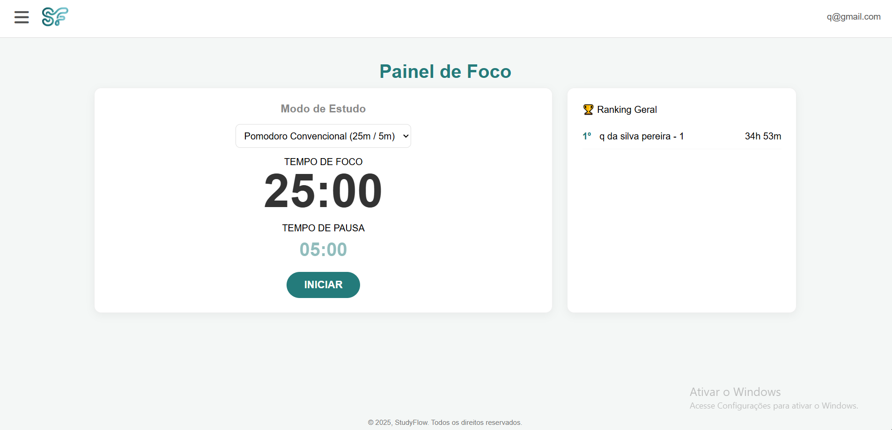
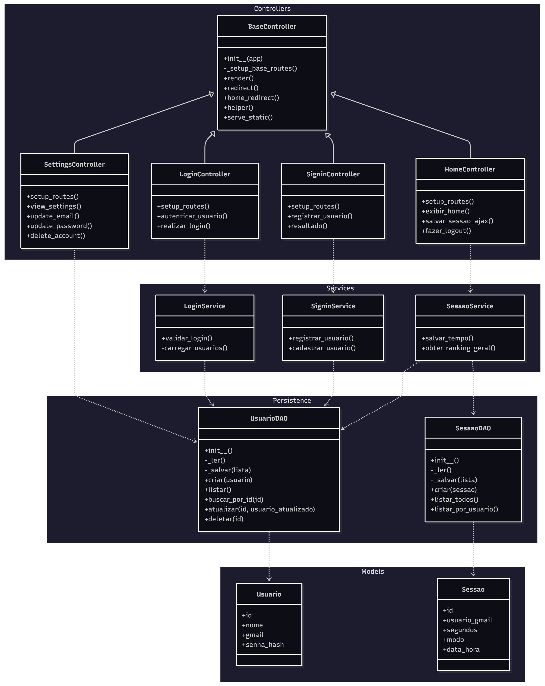

# StudyFlow

## 📚 Sobre o Projeto

O **StudyFlow** é uma plataforma de gerenciamento de tempo de estudos desenvolvida para ajudar estudantes e profissionais a registrar e otimizar seu tempo de aprendizado. Com uma interface intuitiva e funcionalidades robustas, nossa plataforma permite o acompanhamento detalhado do tempo dedicado aos estudos.



---

## 🎯 Funcionalidades Principais

### ⏱️ Registro de Tempo de Estudo
- **Cronômetro Inteligente**: Controle preciso do tempo de estudo
- **Sistema de Pausas**: Registro automático de intervalos durante as sessões
- **Histórico Detalhado**: Armazenamento completo de todas as sessões de estudo

### 📊 Análises e Estatísticas
- **Dashboard Estatístico**: Visualização gráfica do progresso
- **Métricas de Desempenho**: Análise de produtividade e consistência

### 🏆 Sistema de Ranking
- **Leaderboard Competitivo**: Classificação dos usuários com maior tempo de estudo
- **Comparação Saudável**: Incentivo à produtividade através da competição amigável

### ⚙️ Configurações Avançadas
- **Gerenciamento de Perfil**: Alteração de email e senha
- **Controle de Conta**: Opção de deletar conta permanentemente

## 🏗️ Arquitetura e Tecnologias

### Padrão Arquitetural
- **MVC (Model-View-Controller)**: Separação clara de responsabilidades
- **Framework Bottle**: Micro-framework web rápido e eficiente para Python

### Backend
- **Python 3**: Linguagem principal do servidor
- **JSON**: Persistência de dados leve e eficiente

### Frontend
- **JavaScript**: Interatividade e dinamismo da interface
- **CSS**: Estilização e design responsivo

## 📁 Estrutura do Projeto

```
EPF-STUDYFLOW/
├── controllers/ 
│   ├── __init__.py
│   ├── base_controller.py
│   ├── home_controller.py
│   ├── login_controller.py
│   ├── settings_controller.py
│   ├── signin_controller.py
│   └── statistics_controller.py
├── data/  
│   ├── sessoes.json
│   └── usuarios.json
├── models/
│   ├── sessao.py
│   └── usuarios.py
├── services/
│   ├── login_service.py
│   ├── sessao_service.py
│   ├── settings_service.py
│   ├── signin_service.py
│   └── statistics_service.py
├── static/  
│   ├── css/
│   ├── img/
│   └── js/
├── views/ 
│   ├── estatisticas.tpl
│   ├── helper-final.tpl
│   ├── home.tpl
│   ├── layout.tpl
│   ├── login.tpl
│   ├── settings.tpl
│   └── signin.tpl
├── .gitignore
├── .pylintrc
├── app.py         
├── config.py          
├── main.py
├── Makefile
├── README.md       
└── requirements.txt    
```

## 🔧 Como Rodar o Projeto

# 1. Clone o repositório para a sua máquina
git clone https://github.com/arthur-mariani/epf-StudyFlow.git

# 2. Navegue até a pasta do projeto
cd epf-StudyFlow

# 3. Crie um ambiente virtual
python -m venv venv

# 4. Ative o ambiente virtual
# No Windows (CMD):
venv\\Scripts\\activate
# No macOS/Linux:
source venv/bin/activate

# 5. Instale as dependências
pip install -r requirements.txt

# 6. Delete qualquer base de dados antiga (se existir) para garantir uma estrutura limpa e execute a aplicação. O banco será criado automaticamente.
python main.py

# 7. Abra o seu navegador e acesse http://localhost:8080

---

## 📐 UML - Diagrama de Classes



---

**StudyFlow** - Transformando tempo em conhecimento! 📖⏰

---

👥 Autores
[Arthur Mariani de Andrade da Cruz]
[Matheus Rodrigues Pontes]
[Lucas Araújo Lima]